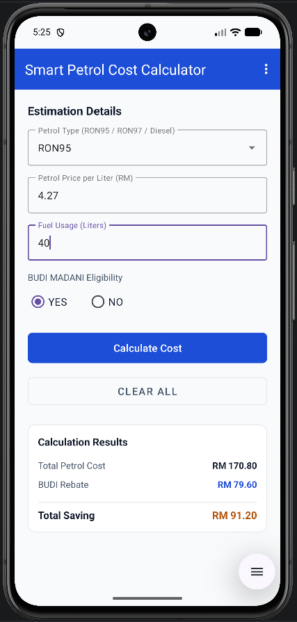

# Smart Petrol Cost Calculator with BUDI MADANI Rebate Malaysia

An Android application designed to help Malaysian drivers calculate their dynamic fuel consumption costs and estimate their eligible BUDI MADANI cash rebates.

## Features
* **Dynamic Petrol Selector:** Choose between RON95, RON97, and Diesel.
* **BUDI MADANI Status:** Interactive Radio Button implementation (YES/NO) for eligibility check.
* **Instant Calculations:** Displays Total Petrol Cost, BUDI Rebate (RM1.99/L for eligible RON95 users), and Total Savings instantly.
* **Modern Material Design UI:** Responsive layout with an options menu toolbar navigation.

## Screenshots

## Code Structure & Quality
* Built with modern Java and Android standard guidelines.
* Strict input validation implemented (prevents empty calculations and standalone decimal point errors).